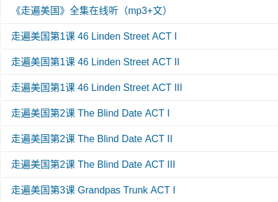
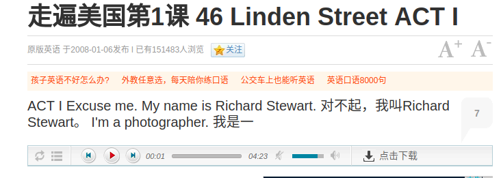
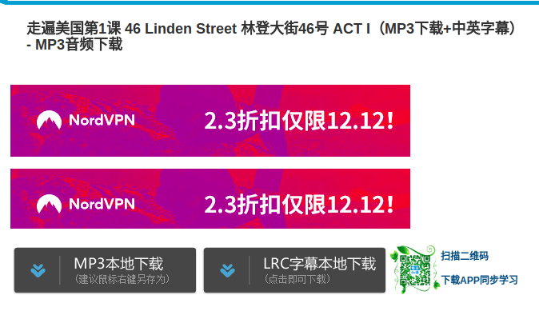

<style>
img{
    width: 60%;
    padding-left: 20%;
}
</style>
padding-left = (100% - width) / 2


# 新手用Python实现英语学习网站资料的批量下载，过程详解
文章的最后有该工程全部代码，可以供大家下载。

## 基本步骤
1. 访问该[英语学习网站](http://www.en8848.com.cn/tingli/brand/USA/)，进行手动下载测试。一共要经过三个页面的跳转才能到达每节课程的下载页面，这样要想把所有课程下载下来可能要天荒地老了。

- 第一个页面：课程列表

	
	
	
- 第二个页面：在线播放

	
	
	
- 第三个页面：下载文件

	

1. 用浏览器自带的页面分析工具（chrome的develop tool），找到每个页面跳转点的代码。
	- 第一个页面含有多节课程的跳转链接,通过工具的指引，找到了第1课的超链接。
	>
		<h4><a href="/tingli/brand/USA/44209.html" title="走遍美国第1课 46 Linden Street  ACT II" target="_blank">走遍美国第1课 46 Linden Street  ACT II</a></h4>

这句话我们可以知道其下载地址就是"/tingli/brand/USA/44209.html", 看着好奇怪为啥不是HTTP开头，其实这个地址是相对于服务器的根地址而言的，这个页面的完整URL就是[](http://www.en8848.com.cn/tingli/brand/USA/44209.html),这样就可以得到第1课的第一个跳转页面的地址了。如何批量获取所有课程的第一个跳转地址？
利用浏览器的"view page source" 功能可以看到主页面的所有HTML代码，可以发现所有课程的第一跳转链接都放在一起，而且其中的title属性的内容都是“走遍美国第×课”，这样就可以通过分析主页面的HTML代码，取出tiltle为“走遍美国第” 开头的所有超链接的内容，就可以获取到当前主页上所有课程的跳转链接。

- 点击[第1课的的跳转链接](http://www.en8848.com.cn/tingli/brand/USA/44209.html),此时可以看到第1课的在线音频和字幕，可以看到有一个[点击下载](pic/index-1), 我们通过chrome的developer tool 和view page source 功能，找到了这个下载路径，其实这是一个JS的页面跳转

```
$(".jp-download").click(function(){
			window.open('/e/action/down.php?classid=9340&id=44209&mp3=http://mp3.en8848.com/zhuo-bian-mei-guo/Family-Album/FamilyAlbum.rar">http://Mp3') ;   
		});		
 ```
 
 分析到此，第二个步骤已经基本结束了，下面就是如何使用程序自动分析出所有课程的下载路径和自动下载所有的文件。

3. 利用Python语言自动化上面的操作

- 自动获取HTML页面
	主要用到2个模块:urllib 和 requests, urllib 主要负责发送URl请求的，requests是对urllib进行封装，然后大家可以更优雅的发送HTTP的请求。请求的核心代码如下：
```
response = requests.get(urlStr)
        response.encoding = response.apparent_encoding
        str = response.text
```

- 如何从第一个页面分析出下一级页面的链接地址
  主要用到的模块是BeautifulSoup,这个模块的专长是解析HTML，将HTML页面的内容以更加程序员的方式呈现给程序员，同时还提供了强大的findall接口。
	- 解析HTML的代码
	```
	soup = BeautifulSoup(response.text, "html.parser")
	其中response.text 就是HTML页面源码，就是上面第二步中用浏览器的View page  source 看到的内容，html.parser 其实页是python的一个解析HTML的模块，不过这个模块需要写大量的回调来处理HTML，从而得到你想要的数据，这边我们可以把它理解成是一种HTML的解析引擎。而BeautifulSoup可以选用多种HTML解析引擎，最终以合适方式给你返回结果。
	```

	- 从上面解析的HTML代码中匹配到需要的内容

	1. 正则匹配出第一个页面的跳转地址：
	```
    pattrn = re.compile('\s*' + u'走遍美国第')
    res = soup.find_all('a', title=pattrn)
	```
	基本思路就是找到超链接的title是以”走遍美国第“字符串开头的url。

	2. 正则匹配到每个文件的下载页面的URL
	```
        for script_str_obj in soup.find_all("script"):
            script_str = script_str_obj.text
            if script_str.find("jp-download") != -1:
                pattern = re.compile('(?<=jp-download)(.+?)open\s?'
                                     '\(\s?\'(.+?)\s?\'\)(.+?)(?<=;)', re.S)
                res = re.search(pattern, script_str)
	```
	下载页面的URL是通过一个JS的函数进行跳转的，所以先从页面代码里面找到对应的函数的内容，然后再对这个函数使用正则匹配，截取出URl的具体内容。
	3. 正则匹配每个文件的下载路径
	```
        res = soup.find('a', id="dload")
        if 'href'in res.attrs:
            dowloadUrls["mp3"] = res.attrs['href']
        res = soup.find('a', id="dloadword")
        if 'href' in res.attrs:
            dowloadUrls["lrc"] = res.attrs['href']

	```
最终的下载地址，通过正则匹配超链接的id为dload和dloadword这两个URL，第一个对应的是音频的下载路径，第二个对应的是字幕的下载路径。

## 结束语
这个实验主要涉及HTTP请求，HTML解析，JS基本知识，以及正则表达的基本使用。该工程的源码已经放在github上面，[项目地址](https://github.com/haicg/BigDataBeeCode/tree/master/CrawlEngSource)
